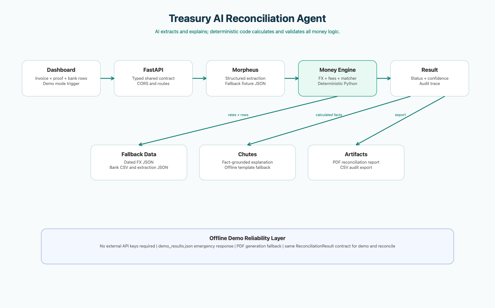

# Treasury AI Reconciliation Agent

An offline-capable cross-border reconciliation agent built for **AI Marathon 2026**,
Track 3: **Global Treasury Agent**. It turns invoice data, payment proof data, and
local bank statement rows into a traceable reconciliation result and exportable artifacts.

## Project Overview

Small and medium businesses receive cross-border payments in a different currency from
the invoice currency. A USD invoice may appear as a MYR bank credit after an exchange
rate and incoming-wire fees. This MVP demonstrates a reliable workflow for identifying
the best bank match, exposing every money calculation, and producing an audit artifact.

The design follows one trust rule:

> AI extracts and explains; deterministic code calculates and validates all money logic.

## Problem Statement

Manual reconciliation requires finance teams to read payment proofs, verify invoice
references, find dated FX rates, account for fees, compare bank credits, and document
discrepancies. The process is slow and vulnerable to transcription errors, especially
for small teams without treasury tooling.

## Solution Architecture

The application implements this path:

1. The dashboard triggers a demo reconciliation or future uploaded-document flow.
2. A Morpheus-compatible extractor returns typed invoice and payment fields, using
   committed JSON fixtures when a live provider is unavailable.
3. Deterministic Python code applies fallback FX rates and a named bank fee rule.
4. The matcher scores bank rows using date, payment reference, and amount proximity.
5. A Chutes-compatible explanation wrapper produces a concise business explanation
   from calculated facts only.
6. The backend generates a PDF reconciliation report and CSV audit log.



## Tech Stack

| Layer | Technology | MVP Purpose |
|---|---|---|
| Backend | FastAPI, Pydantic, Uvicorn | Modular typed API and shared response contract |
| Frontend | React, Vite | Single-page demo dashboard and API integration |
| Extraction | Morpheus wrapper placeholder | Mocked structured invoice/payment extraction |
| Explanation | Chutes wrapper placeholder | Deterministic offline-friendly explanations |
| Matching | Python, RapidFuzz fallback support | Explainable scoring and decisions |
| FX and fees | Python + local JSON | Deterministic calculations with no network dependency |
| Artifacts | ReportLab, CSV | PDF reconciliation report and audit export |

## Team Structure

| Role | Focus |
|---|---|
| Role 1 - Agent Lead / Backend | FastAPI orchestration, schemas, provider wrappers, integration |
| Role 2 - Data Engineer | FX, fees, matcher, report/export, demo data |
| Role 3 - Frontend Developer | Dashboard, upload UX, result visualization, API calls |
| Role 4 - Pitch / Demo / QA | Slides, README, screenshots, walkthrough, QA |

See [docs/context.md](docs/context.md) for branch ownership, checkpoints, and the
locked API contract.

## Branch Workflow

`main` is the integration branch. Role owners work on short-lived branches:

```bash
git checkout main
git pull origin main
git checkout -b backend/extraction
git checkout -b backend/matching main
git checkout -b frontend/dashboard main
git checkout -b demo/docs main
```

Commit in small working units, open pull requests into `main`, and have Role 1 merge
only after the shared contract and demo endpoint still pass. Before each checkpoint,
every branch pulls `main`, resolves conflicts on its own branch, and reruns its smoke
test.

## Folder Structure

```text
treasury_hackathon/
|-- backend/
|   |-- app/
|   |   |-- main.py
|   |   |-- models/schemas.py
|   |   |-- routers/{health,demo,reconcile,report}.py
|   |   |-- services/
|   |   `-- utils/
|   |-- requirements.txt
|   `-- .env.example
|-- frontend/
|   |-- src/{components,lib}/
|   |-- src/App.jsx
|   `-- package.json
|-- data/
|   |-- demo/
|   `-- outputs/{reports,exports}/
|-- docs/
|   |-- architecture_diagram.png
|   `-- context.md
|-- .gitignore
`-- docker-compose.yml
```

## Setup Instructions

Requirements:

- Python 3.9 or later
- Node.js 18 or later and npm
- Optional: Docker Desktop for one-command service startup

On macOS, if `npm` is not available:

```bash
brew install node
node --version
npm --version
```

Backend setup:

```bash
cd backend
python3 -m venv .venv
source .venv/bin/activate
pip install -r requirements.txt
cp .env.example .env
```

The default `DEMO_MODE=true` makes provider keys optional and keeps all results local.

Frontend setup:

```bash
cd frontend
npm install
```

## Backend Run Commands

```bash
cd backend
source .venv/bin/activate
uvicorn app.main:app --reload --port 8000
```

Open API documentation at `http://localhost:8000/docs`.

## Frontend Run Commands

In a second terminal:

```bash
cd frontend
npm run dev
```

Open `http://localhost:5173`. Set `VITE_API_BASE_URL` only if the backend is hosted
somewhere other than `http://localhost:8000`.

Docker alternative:

```bash
docker compose up
```

## API Endpoints

| Method | Route | Purpose |
|---|---|---|
| GET | `/api/health` | Backend status and active mode |
| GET | `/api/demo` | Run the offline golden-path reconciliation |
| POST | `/api/reconcile` | Reconcile optional structured inputs or default fixtures |
| GET | `/api/report/{job_id}` | Download the generated PDF report |
| GET | `/api/export/{job_id}` | Download the generated CSV audit log |

`GET /api/demo` and `POST /api/reconcile` both return `ReconciliationResult`:

```json
{
  "job_id": "demo_001",
  "status": "matched",
  "confidence": 1.0,
  "invoice": {},
  "payment": {},
  "best_match": {},
  "fx_trace": {},
  "fee_trace": {},
  "score_breakdown": {},
  "explanation": "",
  "warnings": []
}
```

Structured POST example:

```bash
curl -X POST http://localhost:8000/api/reconcile \
  -H "Content-Type: application/json" \
  -d '{}'
```

## Demo Flow

1. Start backend and frontend, then click **Run Demo Mode**.
2. The fallback extraction fixtures produce invoice `INV-2026-0412` for `USD 100.00`.
3. Stored FX rate `USD/MYR 4.3300` converts the invoice to `MYR 433.00`.
4. The incoming-wire rule applies `1.5% + MYR 5.00`, yielding `MYR 421.50`.
5. Row `row_003` in the bank statement credits `MYR 421.50`, producing a match.
6. Download the PDF report and audit CSV directly from the result panel.

## Fallback Strategy

The demo does not rely on an external network or an API key:

- `fallback_extracted_invoice.json` replaces unavailable invoice extraction.
- `fallback_extracted_payment.json` replaces unavailable payment proof extraction.
- `fallback_fx_rates.json` replaces unavailable live dated FX lookup.
- `demo_results.json` is an emergency complete response if the pipeline fails.
- PDF generation has a basic built-in output path if ReportLab is unavailable.

The mock provider boundaries are intentionally stable so real Morpheus and Chutes
adapters can be connected later without changing the API contract.

## Future Improvements

- Multipart invoice/payment uploads and CSV/XLSX parsing routes.
- Live Morpheus extraction and Chutes explanation behind the existing wrappers.
- Live FX lookup with cached dated-rate fallback.
- Needs-review case toggles, batch reconciliation, and human approval workflow.
- Accounting integrations and secure document storage.

## Integration Checklist

- Confirm `GET /api/health` returns `status: ok`.
- Confirm `GET /api/demo` renders in the React dashboard.
- Confirm `POST /api/reconcile` returns the same field structure as demo.
- Confirm PDF and CSV links download generated artifacts.
- Record the final demo in `DEMO_MODE=true` after the above checks pass.
